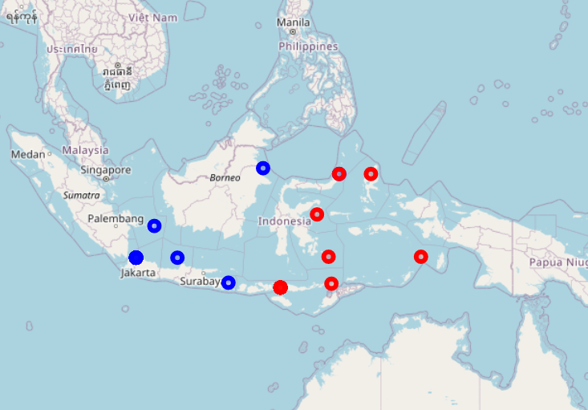

# Bacterial communities associated with *Syringodium isoetifolium* across Wallace's Line

This codebase is part of the **Microbiome Boot Camp** course at Utah Valley University. 

-- *Syringodium isoetifolium* meadow (Wiki commons)

-- Study area, colors denote location as West or East of Wallace's Line

- Samples and data generated by the [Wainwright Lab](https://www.yale-nus.edu.sg/faculty/benjamin-wainwright/) at the National University of Singapore.
