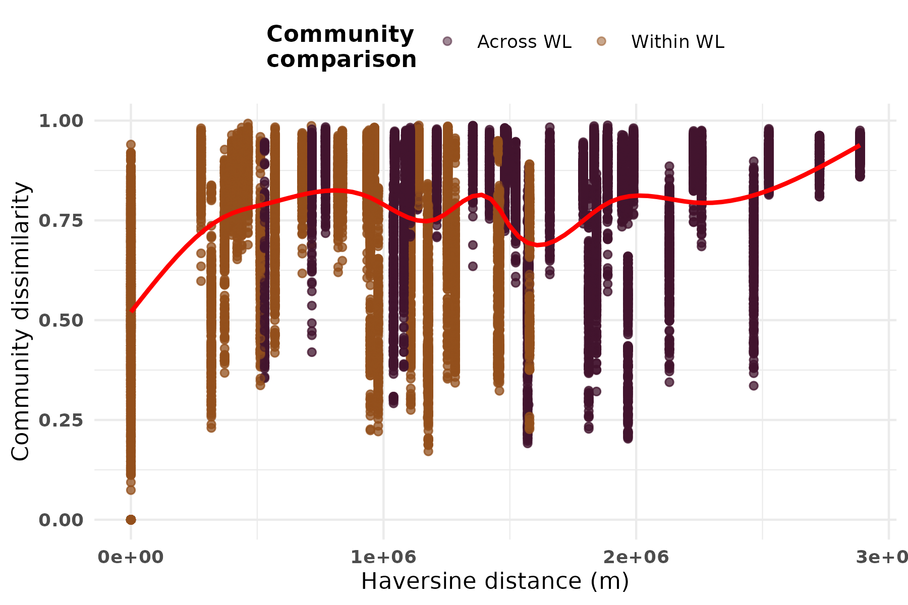
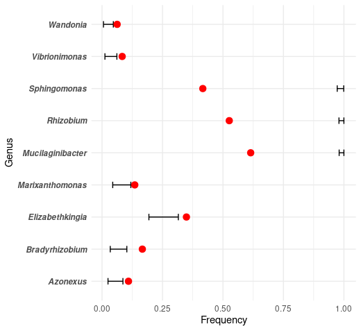
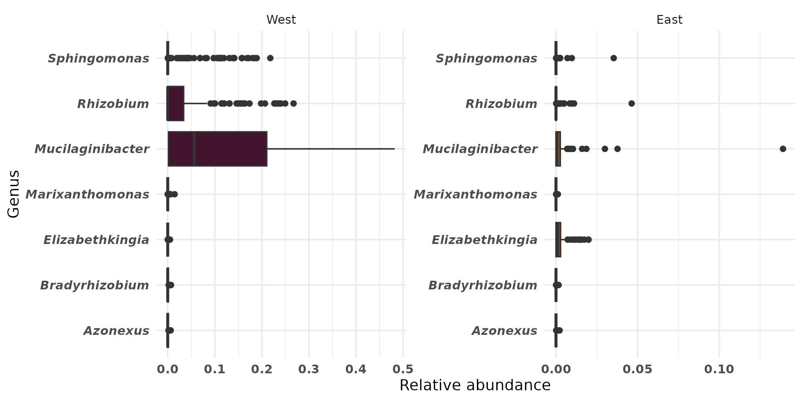

```{r setup, include=FALSE}
knitr::opts_chunk$set(echo = FALSE,warning = FALSE,message = FALSE)
library(tidyverse)
library(vegan)
library(kableExtra)
```

<br>

___

<br>

# Appendix S1: Alpha-Diversity

```{r}
shannon <- readRDS("./shannon_div_df.RDS") %>% 
  mutate(term = term %>% str_remove("island"),
         term = term %>% str_remove("West"))


readLines("../output/alpha_mod_observed_summary.txt")

#shannon %>% 
 # kable(caption = "SI Table 1. Shannon Diversity GLM. Bold indicates P-value less than 0.05") %>% 
  #kable_classic(lightable_options = 'striped') %>% 
  #row_spec(which(shannon$p.value < 0.05), bold = TRUE)
```


<br>

___

<br>

# Appendix S2: Beta-Diversity 

### PermANOVA Tables:

```{r}
bray_beta <- readRDS("../output/bray_betadiv_df.RDS") %>% 
  mutate(term = term %>% str_remove("ps\\@sam_data\\$"))
unifrac_beta <- readRDS("../output/unifrac_betadiv_df.RDS") %>% 
    mutate(term = term %>% str_remove("ps\\@sam_data\\$"))

```

#### Bray-Curtis Distance

```{r}
bray_beta %>% 
  kable(caption = "SI Table 2. Bray-Curtis PermANOVA. Bold indicates P-value less than 0.05") %>% 
  kable_classic(lightable_options = 'striped') %>% 
  row_spec(which(bray_beta$p.value < 0.05), bold = TRUE)
```

<br>

#### UniFrac Distance

```{r}
unifrac_beta %>% 
  kable(caption = "SI Table 3. UniFrac PermANOVA. Bold indicates P-value less than 0.05") %>% 
  kable_classic(lightable_options = 'striped') %>% 
  row_spec(which(unifrac_beta$p.value < 0.05), bold = TRUE)
```

___

### Beta dispersion:

```{r}
betadisp <- readRDS("../output/beta_dispersion_unifrac.RDS")
betadisp$call
data.frame(
  dists=betadisp$distances,
  group = betadisp$group
) %>% 
  group_by(group) %>% 
  summarize(mean = mean(dists),
            sd = sd(dists)) %>% 
  mutate(across(where(is.numeric),function(x){round(x,4)})) %>% 
  kable(caption = "Table 4. Distance to centroid summaries for beta-dispersion.") %>% 
  kable_classic(lightable_options = 'striped')


plot(betadisp)
```


<br>

___

<br>

# Appendix S3: Distance Decay

### Multiple Regression on Matrices

```{r}
readRDS("../output/MRM_table.RDS") %>% 
  kable(caption = "SI Table 5. Call: MRM(asv_dist ~ haversine_dist,nperm=1000)") %>% 
  kable_classic(lightable_options = 'striped')
```


### Mantel Test

```{r}
readRDS("../output/mantel_table.RDS") %>% 
  kable(caption = "SI Table 6. Mantel Test statistics.") %>% 
  kable_classic(lightable_options = 'striped')

```

### Distance decay plot

```{r}

```


<br>

___

<br>

# Appendix S4: Differential Abdundance


### ASV-level

```{r}
bbd <- readRDS("../output/bbdml_significant_mod_tables_ASV.RDS")
bbd %>% 
  mutate(across(where(is.numeric),function(x){round(x,4)})) %>% 
  kable(caption = "SI Table 7a. BBDML model estimates from all significant ASVs (including ASV sequence).") %>% 
  kable_classic(lightable_options = 'striped') %>% 
  scroll_box(height = "600px")


```


### Genus-level
```{r}
bbd <- readRDS("../output/bbdml_significant_mod_tables.RDS")

bbd %>% 
  mutate(across(where(is.numeric),function(x){round(x,4)})) %>% 
  kable(caption = "SI Table 7b. BBDML model estimates from all significant genera (from corncob).") %>% 
  kable_classic(lightable_options = 'striped') %>% 
  scroll_box(height = '600px')
?scroll_box

```


### Neutral Community Model


ASVs (identified here by their Genus assignment) that had significant deviations (red dots) from the Sloan Neutral Community Model (error bars).

```{r}

```


### Relative abundance of differentially abundant taxa

```{r}

```

*Note different x-axis scale for West and East facets*

<br>

___

# Appendix S5: Bacterial morphology

Bacterial genera traits were pulled from BacDive.


## Cell size

Table S5: Trait information for significant genera

```{r}
read_csv("./significant_taxa_traits_kh.csv") %>% 
  dplyr::filter(genus %in% c("Mucilaginibacter",
                           "Rhizobium",
                           "Sphingomonas",
                           "Elizabethkingia",
                           "Bradyrhizobium",
                           "Marixanthomonas",
                           "Azonexus")) %>% 
  mutate(dominant = case_when(genus == "Elizabethkingia" ~ "East",
                              TRUE ~ "West"),
         shape = "rod") %>% 
  kableExtra::kable() %>% 
  kableExtra::kable_classic(lightable_options = 'hover')
```


Distributions of cell dimensions and shapes for significant taxa were compared to the overall distributions for all detected taxa.

```{r, fig.cap="Comparitive distributions of minimum cell dimensions"}
knitr::include_graphics("./figs/minimum_cell_dimension_distribution.png")
```

GLM model for minimum dimension distribution:

```{r}
dim_mod <- readRDS("./cell_dimension_glm.RDS")
xsqtest <- readRDS("./cell_shape_xsq.RDS")
dim_mod$formula
dim_mod %>% 
  broom::tidy() %>% 
  kableExtra::kable() %>% 
  kableExtra::kable_classic(lightable_options = 'hover')
```

<br>

## Cell shape

Chi-square test results for significant taxa cell shapes:

```{r}
xsqtest
```
There is no apparent enrichment in cell shape morphology in significant taxa

<br>

## Cell morphology data

Data extracted from [BacDive](https://bacdive.dsmz.de/)

```{r}
readRDS("./cell_morphology_data.RDS") %>% 
  select(-c(est_vol,est_surface_area)) %>% 
  kableExtra::kable() %>% 
  kableExtra::kable_classic(lightable_options = "hover") %>% 
  kableExtra::scroll_box(height = '600px')
```
<br>

# Appendix S6: Sample metadata

```{r}
readxl::read_xlsx("../data/SI_Indo_Metadata_CorrectGPS.xlsx") %>% 
  dplyr::select(-Barcode) %>% 
  kableExtra::kable() %>% 
  kableExtra::kable_classic(lightable_options = "hover") %>% 
  kableExtra::scroll_box(height = '600px')
```


<br><br><br>